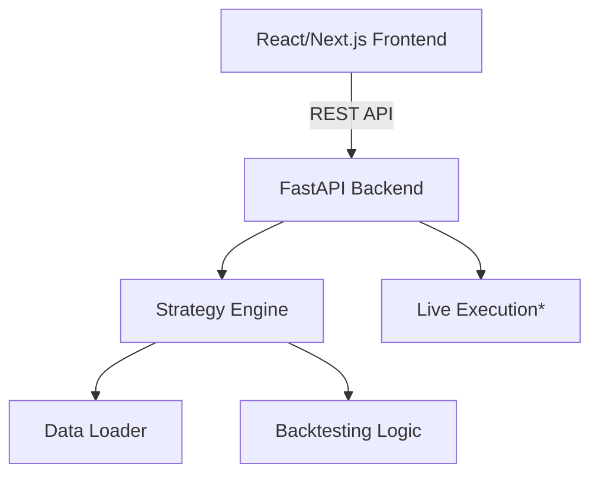

# ⚡ ALGO-BOT 

> **Deployment-Ready Smart High-Frequency Trading System**  
> *Quantitative Execution | Cyber-Finance Interface | Institutional Strategies*


---

## 🚀 Overview

**ALGO-BOT** is a next-generation algorithmic trading platform engineered for the **BatraHedge Hackathon**. It integrates state-of-the-art quantitative strategies (HMM, Kalman Filters) with a futuristic "Cyber-Finance" execution interface.

Unlike traditional bots, ALGO-BOT features **Market Regime Detection**—it knows when to trade aggressive momentum and when to switch to mean reversion.

## 🧠 Quantitative Core (Strategies)

| Strategy | Type | Math / Logic |
| :--- | :--- | :--- |
| **Regime-HMM Momentum** | *Adaptive* | Uses **Hidden Markov Models** (Gaussian Mixture) to classify market states (Trending vs Volatile) and adjust leverage dynamically. |
| **Kalman-Pairs Arbitrage** | *Statistical* | Implements a **Kalman Filter** to estimate the dynamic hedge ratio between cointegrated assets on the fly. |
| **OU Mean Reversion** | *Statistical* | Models price action as an **Ornstein-Uhlenbeck** stochastic process to identify statistically significant deviation. |
| **Simple Momentum** | *Trend* | Classic dual-moving average crossover with volatility-adjusted position sizing. |
| **Buy & Hold** | *Baseline* | Benchmark strategy for performance comparison. |
| **Ensemble (HMM+OU)** | *Meta* | **Dynamic Switching**: Transitions between Momentum and Mean Reversion based on HMM Regime state. |

## 🏗️ Architecture

The system follows a modern **Microservices-ready** architecture:



-   **Frontend**: Next.js 15, TailwindCSS (Cyber Theme), Lightweight Charts v4.
-   **Backend**: Python FastAPI, Pydantic, NumPy/Pandas.
-   **Math Kernel**: `hmmlearn`, `scikit-learn`, `statsmodels`.

## ⚡ Quick Start

### 1. Backend Service
Initialize the Python quantitative engine.

```bash
# From root directory
pip install -r requirements.txt
python main.py
```
*Server starts on `http://localhost:8000`*

### 2. Frontend Interface
Launch the Cyber-Finance dashboard.

```bash
cd frontend
npm install
npm run dev
```
*Visit `http://localhost:3000`*

## 🛡️ Risk Management
-   **Dynamic Position Sizing**: Based on volatility (ATR) and Kelly Criterion estimates.
-   **Regime Filtering**: Trading is halted or reduced during "Volatile/Crash" regimes detected by the HMM.
-   **Stop-Loss**: Hard stops integrated into the execution engine.

---
**Built for BatraHedge Hackathon 2026**  
*Speed. Precision. Alpha.*
